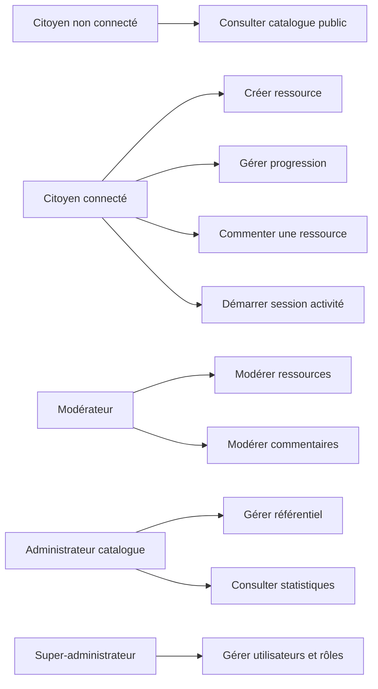
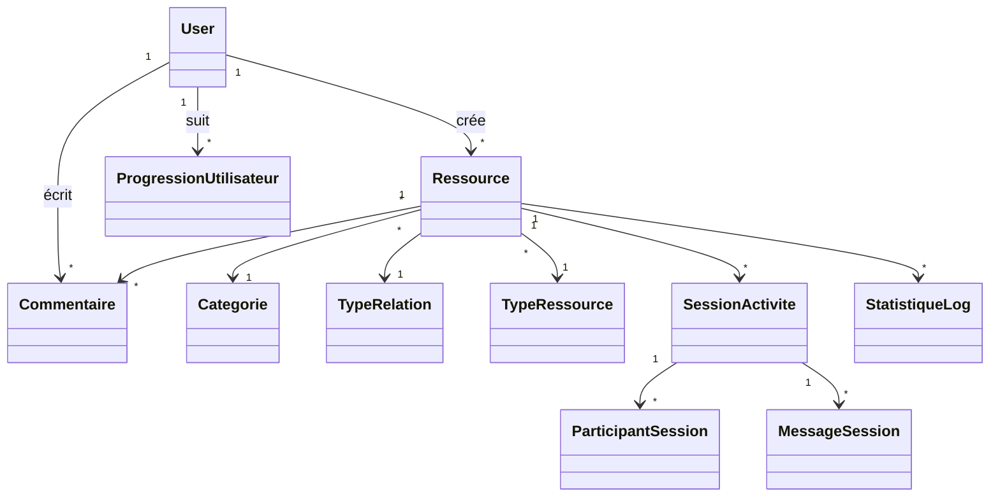

# Architecture logicielle

## Vue d'ensemble

L'application suit une architecture proche MVC adaptée à Next.js :

- Modèle : schéma Prisma, base PostgreSQL, validations Zod.
- Vue : pages et composants React dans `src/app` et `src/components`.
- Contrôleur : routers tRPC dans `src/server/api/routers`.

## Modules principaux

- Authentification : Better Auth, rôles et middleware.
- Ressources : consultation, création, filtrage et partage.
- Référentiel : catégories, types de relations, types de ressources.
- Progression : favoris, mises de côté, ressources exploitées.
- Commentaires : publication citoyenne et modération.
- Sessions : démarrage d'activité, participants et messages.
- Statistiques : logs d'actions et exports.

## Diagramme de cas d'utilisation

## Diagramme de classes simplifié

## Sécurité

Les droits critiques sont vérifiés côté serveur :

- Back-office : rôle staff requis.
- Gestion utilisateurs : super-administrateur uniquement.
- Gestion référentiel : administrateur catalogue ou super-administrateur.
- Modération : modérateur, administrateur catalogue ou super-administrateur.
- Sessions : seuls les participants ou le staff peuvent lire et écrire.
