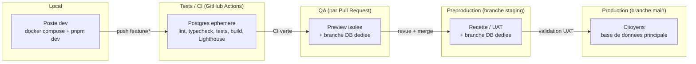
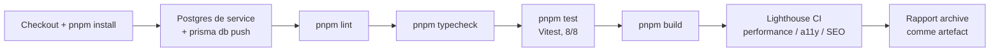
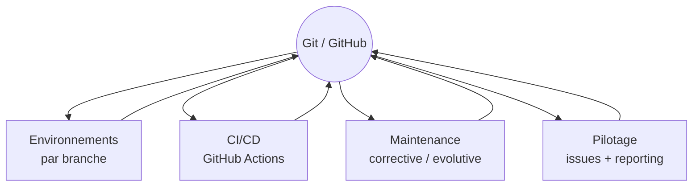

# Plan de déploiement — (RE)Sources Relationnelles

Ce document couvre le run déploiement du projet (bloc AL3) : démarche, environnements, automatisation, intégration continue, versioning et pilotage. Il complète le [plan de sécurisation](../securite/plan-securisation.md), avec lequel il partage la même base : le dépôt Git `tymacz/ressource`.

État au 26/08/2026 : le socle CI et le versioning sont en place et vérifiés (voir §5 et §6). L'hébergement live (QA/préproduction/production réelles) est une étape volontairement reportée après la stabilisation du socle sécurité/CI — l'architecture cible est documentée ci-dessous pour que la mise en service se limite à créer les comptes et à les relier au dépôt.

## 1. Démarche cohérente avec le contexte ministériel

Le projet s'inscrit dans un contexte où la donnée traitée (usages, statistiques, comptes citoyens) impose une démarche de mise en production prudente et traçable :

- **Aucune mise en production directe** : tout changement passe par une Pull Request revue, avec une CI verte comme prérequis (voir §5), avant fusion sur `staging` puis `main`.
- **Traçabilité de bout en bout** : chaque déploiement correspond à un commit identifiable, chaque exécution de CI est archivée (logs + rapport Lighthouse), chaque incident est documenté en issue GitHub.
- **Validation par étapes** : une évolution est d'abord vérifiée automatiquement (CI), puis fonctionnellement en environnement de préproduction, avant d'atteindre les citoyens.
- **Conformité déjà actée dans le projet** : RGPD et RGAA sont pris en compte dès la conception (voir `docs/cahier-des-charges.md`, `docs/merise.md`) ; le plan de sécurisation traite du chiffrement et de la gestion des secrets.

## 2. Environnements

| Environnement | Rôle | Déclencheur | Statut |
|---|---|---|---|
| **Local** | Développement au poste | `docker compose up -d` + `pnpm dev` | ✅ en place |
| **Tests / CI** | Vérification automatique de chaque changement | push ou Pull Request (voir §5) | ✅ en place |
| **QA (préversion)** | Vérifier une fonctionnalité isolée avant intégration | déploiement de preview à chaque Pull Request | 🔜 architecture cible définie ci-dessous |
| **Préproduction** | Recette / validation utilisateur avant mise en production | déploiement automatique de la branche `staging` | 🔜 architecture cible définie ci-dessous |
| **Production** | Environnement réel des citoyens | déploiement automatique de la branche `main` | 🔜 architecture cible définie ci-dessous |

**Architecture cible retenue** (à activer lors de l'ouverture des comptes d'hébergement) : hébergement de l'application sur une plateforme avec déploiement automatique par branche (ex. Vercel), base de données PostgreSQL managée avec branches de base de données isolées par environnement (ex. Neon), pour que QA/préproduction disposent chacune de leurs propres données sans jamais toucher la production.

## 3. Étapes et ressources mobilisées

1. **Développement** : branche `feature/*` créée depuis `staging`, commits descriptifs.
2. **Ouverture d'une Pull Request** vers `staging` : déclenche la CI (§5) et une preview QA.
3. **Revue de code** : au moins une relecture avant fusion (via le template de PR, `.github/pull_request_template.md`).
4. **Fusion sur `staging`** : déploiement automatique en préproduction, recette fonctionnelle.
5. **Promotion vers `main`** : Pull Request `staging` → `main` une fois la recette validée, CI rejouée, déploiement automatique en production.
6. **Vérification post-déploiement** : contrôle visuel rapide + suivi du monitoring de disponibilité (§8).

Ressources mobilisées : minutes GitHub Actions (gratuites pour un dépôt de cette taille), temps de revue de code de l'équipe, environnements d'hébergement (à provisionner lors de l'activation de l'architecture cible du §2).

## 4. Déploiements automatisés et amélioration continue

- Le déploiement est déclenché par la fusion sur `staging` ou `main` — aucune action manuelle de mise en production.
- **Rollback** : redéploiement instantané d'un commit/tag antérieur (le versioning Git fait foi, voir §6) — pas de reconstruction manuelle.
- **Amélioration continue** : chaque exécution de CI produit un rapport Lighthouse (performance, accessibilité, SEO) archivé comme artefact de build (voir §5), permettant de suivre l'évolution de ces indicateurs dans le temps et de détecter une régression avant qu'elle n'atteigne la production.
- Le premier passage de Lighthouse CI a déjà permis de détecter 3 écarts RGAA réels sur `/catalogue` (bouton de filtre sans nom accessible, contraste insuffisant, ordre de titres incorrect) — preuve que la boucle d'amélioration continue fonctionne dès sa mise en place.

## 5. Intégration continue avec tests unitaires et de performance

Pipeline `.github/workflows/ci.yml`, déclenché sur chaque push vers `main`/`staging` et sur chaque Pull Request :

- **Tests unitaires** : Vitest (`src/lib/auth/roles.test.ts`, `src/lib/cesizen/ressource-access.test.ts`, `src/lib/validations/ressource.test.ts`), exécutés à chaque run.
- **Tests de performance** : Lighthouse CI (`lighthouserc.json`) sur les pages publiques clés (`/`, `/catalogue`, `/informations`), seuils en avertissement pour ne pas bloquer les fusions sur un score fluctuant selon le runner, tout en gardant une trace exploitable.
- **Ordre des étapes** volontairement du moins coûteux (lint) au plus coûteux (build, Lighthouse), pour échouer vite.
- Dependabot (`.github/dependabot.yml`) complète ce dispositif en maintenant les dépendances à jour en continu (voir plan de sécurisation §4).

## 6. Versioning — le pivot du dispositif

Git/GitHub est au centre du dispositif : c'est lui qui déclenche la CI, qui matérialise les environnements par branche, qui trace les correctifs et évolutions, et qui sert de source pour le pilotage.

**Stratégie de branches** (GitHub Flow à trois niveaux) :
- `main` — production, toujours déployable.
- `staging` — préproduction / recette.
- `feature/*` — une branche par travail, créée depuis `staging`.
- `hotfix/*` — correctif urgent, créé depuis `main` (voie express, voir §7).

**Convention de commits** : préfixes `feat`, `fix`, `docs`, `ci`, `chore` (déjà appliqués sur les commits de sécurisation et de CI de ce lot). **Tags** : une release taguée à chaque promotion en production (ex. `v1.0.0`), pour que le rollback (§4) cible toujours une référence explicite.

**État réel au 26/08/2026** (pas seulement projeté) : dépôt passé d'un historique squashé à 1 commit à un historique vivant de plusieurs commits descriptifs sur `feature/durcissement-dependances` ; branche `staging` créée ; templates de Pull Request et d'issues en place (`.github/pull_request_template.md`, `.github/ISSUE_TEMPLATE/`).

## 7. Maintenances correctives et évolutives

| Type | Origine de la branche | Déclenchement | Exemple |
|---|---|---|---|
| **Corrective** (`hotfix/*`) | `main` | Anomalie bloquante détectée en production | Régression de sécurité, bug bloquant |
| **Évolutive** (`feature/*`) | `staging` | Demande planifiée depuis le backlog (tableau Kanban) | Nouvelle fonctionnalité, amélioration |

Un correctif urgent (`hotfix/*`) est fusionné directement dans `main` puis reporté (« back-mergé ») dans `staging` pour que les deux lignes restent synchronisées. Une évolution suit le circuit complet du §3.

## 8. Pilotage et reporting

| Aspect | Outil / mécanisme |
|---|---|
| Anomalies | Issues GitHub, template `bug_report.md`, label `bug` + niveau de criticité |
| Demandes d'évolution | Issues GitHub, template `evolution_request.md`, label `evolution`, suivies sur le tableau Kanban (GitHub Projects) |
| Performances | Rapports Lighthouse CI archivés à chaque run (voir §5) |
| Disponibilité | À activer avec l'hébergement live (§2) : moniteur externe sur l'URL de production, vérification périodique |
| Revue d'avancement | Historique des Pull Requests et des commits sur `main`/`staging`, seule source de vérité sur ce qui est réellement en production à un instant donné |
